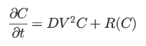
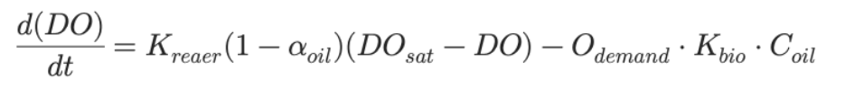
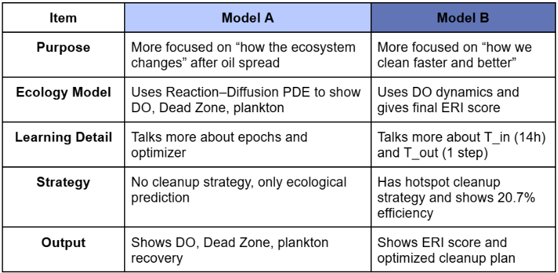
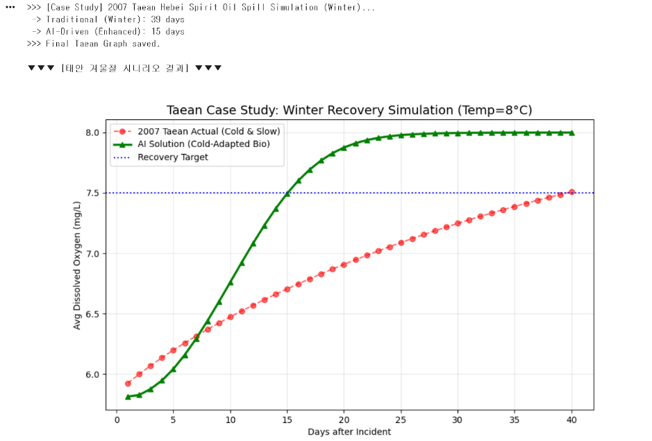
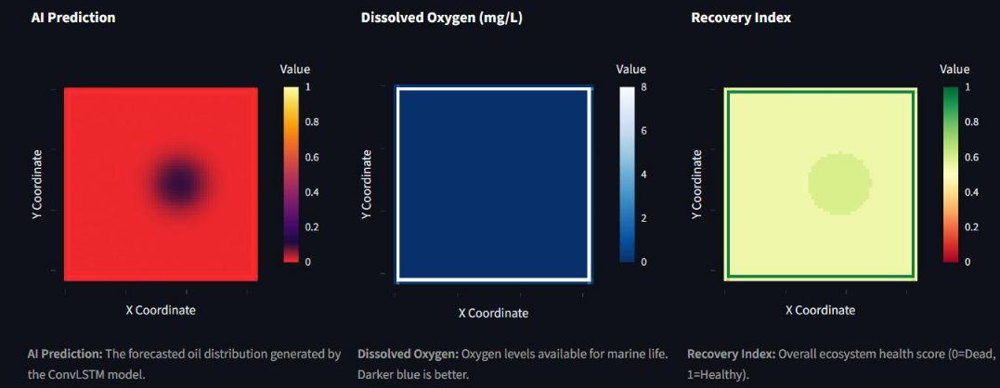
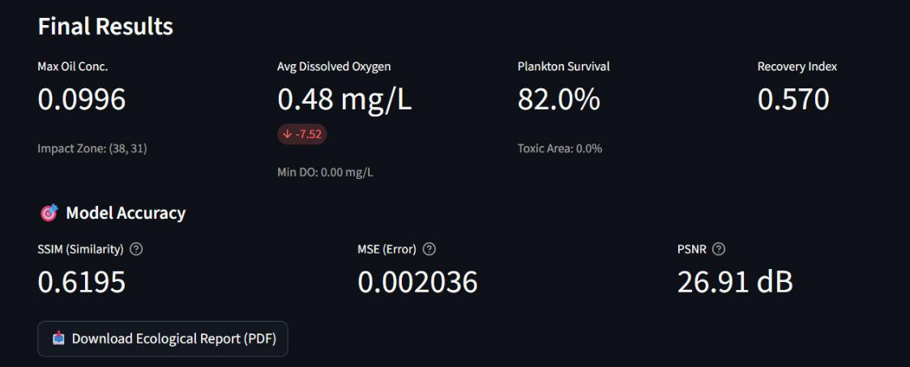

# Summary

1. [ABSTRACT](#1abstract)
2. [INTRODUCTION](#2introduction)
   - [Scientific Background](#1-scientific-background-scientific-knowledge)
   - [Research Necessity and Motivation](#2-research-necessity-and-motivation)
   - [Research Question](#3-research-question---main-question)
3. [MATERIAL & METHOD](#2-materialmethod)
   - [Model A: Prediction Model](#model-a--focused-on-physics-ecology-integrated-prediction-model)
   - [Model B: Cleanup Efficiency](#model-b--focused-on-ai-based-cleanup-efficiency--recovery-optimization-model)
4. [RESULTS](#results)

# 1 ABSTRACT

This study applied two complementary AI - based approaches to improve marine oil split response. First model produced physics - based synthetic data using advection - diffusion formula, and predicted diffusion route and ecological effect (Do decrease, toxic exposure, recovery level). Second model compared random arrangement and AI - based hotspot strategy using predicted pollution levels. Though each model is realized independently, prediction model predict diffusion dynamics exactly and hotspot strategy increases removal effectiveness about 2 times to show potential for future integration.

# 2 INTRODUCTION

## 1 Scientific background, scientific knowledge

### Physics (Fluid Dynamics)

Moving of marine oil spill is a complex action that is caused by advection by ocean currents and diffusion by turbulence. This research calculated temporal and spatial variation of marine oil spill while materializing Advection - Diffusion Equation to imitate this unregular moving.

### Chemistry (Chemical Weathering)

We modeled a biochemical oxygen demand mechanism consuming underwater oxygen rapidly in the process that disassembles the oil. Especially, we quantified Hypoxia by blocking the inflow of atmospheric oxygen (reaeration) due to oil slick.

### Biology (Ecotoxicology)

We applied toxic model based on lethal concentration (LC50) to expect survival of plankton that is the basic of the marine food chain. Also, We produced resilience of the ecosystem by simulating the process of population returning to normal levels after removing contamination using a logistic growth model.

### AI (ConvLSTM)

We launched the ConvLSTM (Convolutional LSTM) model to integrate these 3 scientific principles. This predicts the spread of marine oil split and ecological impacts in the complex marine ecosystem, learning physical fluid movement like spatial information and ecological/chemical changes like temporal information.

## 2 Research necessity and motivation

### Research necessity and motivation

Lesson of Taean accident (social- economical effects) : The 2007 Taean Hebei spirit oil spill accident was a social - economical crisis that caused enormous economic damages (approximately 330 million USD​​) to local fisheries more than a simple environmental disaster. After the surface oil cleanup efforts ended, residual oil existed for a few years damaging seriously to marine ecosystems and local living.

### Limitation of Existing Technology

Limitation of existing technology (invisible damage) : Conventional oil control systems only focus on surface oil removal. However, It has limitations that cannot detect or respond to invisible ecological damage due to dissolved toxins and oxygen depletion (Hypoxia) in the water rapidly.

### Research Purpose (Paradigm Shift)

Research purpose (Paradigm shift) : To overcome these limitations, this research suggests proactive control solutions that prioritized ecological recovery through AI. The final goal is protecting the local community’s right to economic livelihood and achieving ‘ UN Sustainable Development Goal 14 (SDG 14, Life Below water) to shorten the recovery time a lot.

## 3 Research Question - main question

> “ How can an AI system that integrates physical moving, chemical weathering, and biological recovery models optimize the effectiveness of marine disaster response?”

# 2 Material&Method

## Model A : Focused on Physics–Ecology Integrated Prediction Model

### A.Data construction: Physics-based + Evidence-based

To resolve the problem of lacking real-world accident data, we constructed Physics-based synthetic dataset through extensive literature-based review.

- Physical Dynamics: We conducted Advection-Diffusion Equation-based oil spill spread simulation which integrated real-world ocean current data (CMEMS).
- Bio-Chemical Parameters: By setting up the environmental parameter based on literature, we secured ecosystem reality of the model.
- Biodegradation Rate (Kbio): 0.05 ~ 0,07 day-1(Prince et al., 2013).
- Toxicity Threshold (LC50): 30.0 mg/L (Newsted, 1987; Almeda et al., 2013).
- Oxygen Demand: 3.0 g/g (Stoichiometric analysis)

So, Not just simple imaginary data, We use real marine data (NetCDF file) provided by CMEMS (Europe marine monitoring service). We convert this data to PyTorch tensor through the code(convert_data.py) and set the resolution using bilinear interpolation and construct time series learning data using the sliding window method.

### B. model structure: Spatiotemporal Prediction

Model : We designed ConLSTM (Convolutional LSTM) structure that combines CNN and LSTM,

- Through CNN, spatial distribution is achieved,
- Through LSTM, temporal dynamics are learned simultaneously

  Training: We trained the model using over 80,000 hybrid scenarios frames, and optimized the model to predict spread pathways in a complicated ocean current condition.
  Therefore, We construct the ConvLSTM network directly. To learn oil distribution (space) and ocean current flow (time) at the same time, we choose 2-stacked structures. The kernel size was 3x3, and it was designed to extract a complex vector field by setting 32 hidden channels. Learning was performed for 100 Epoch using Adam optimizer and MSE loss function.

### C. Ecological Modeling: Reaction - Diffusion PDE

We designed Reaction - Diffusion PDE to quantify the ecological recovery process.

The reaction term R(C) models microorganism decomposition, reaeration dampening, and the toxic mortality, allowing for calculation of the process of formation and destruction of Dead Zone.
Based on data that was expected by AI, We calculated PDE numerically. At this time, scientific constants such as LC50 (toxicity) and Kbio (biodegradation rate) were implemented in the code (biology_ops.py) based on the paper to increase reliability."

### Conceptual Prototype Design

System Architecture: Feedback Loop Model

_This system designed as Feedback Loop Model: [Detection & prediction -> strategic decision making -> ecological recovery]_

Step 1. Spatiotemporal Prediction

- Input: satellite-based initial oil spill map + live environment / ocean resources (wind speed & ocean current)
- Process: ConvLSTM predicts oil spill pathways and concentration change over the next 5~10 days.

Step 2. Selective Cleanup Strategy

- Protocol: Considering biological sensitivity, create Priority Map based on contamination prediction map
- Decision: Limited cleanup resources (ships, oil boom, etc.) are priorly deployed to Hotspots, maximizing efficiency of ecological damage mitigation.

Step 3. Ecological Recovery Simulation

- Assessment: Based on the concentration of residual contamination, numerically simulate the dissolved oxygen (DO) and Planktonic Biomass.
- Output: Visualize Ecological Recovery Index (ERI) and estimated recovery time (days) to support policy & control decision making.

## Model B : Focused on AI-Based Cleanup Efficiency & Recovery Optimization Model

### A.Data construction: Physics-Informed Hybrid Dataset

To resolve the problem of limited real-world accident data, we constructed the hybrid synthetic dataset fusing numerical physics with real-world oceanography.

- Physical Dynamics: Based on Advection-Diffusion Equation, we calculated oil spill spread, and the ocean data (u,v) is extracted from CMEMS Reanalysis.

- Bio-Chemical Parameters: Biodegradation Rate (k_bio) = 0.07 day^-1 (Default decay constant), Toxicity Threshold (LC_50) = 30 mg/L (Zooplankton 16h lethal concentration), Oxygen Demand = 3.0 g/g (Stoichiometric consumption ratio)

### B. model structure: Spatiotemporal Prediction

- Model: We designed a ConvLSTM-based prediction model to train spread shape of oil spill (via CNN) and time change (via LSTM) at the same time.
- Architecture: We used Stacked ConvLSTM Layer + 3x3 Kernel structure that has 32 Hidden Channel, and optimized it to capture the local fluid dynamics.
- Training: The past leakage history of 14 hours (T_in = 14) was received as input and learned based on one-step forecast performing next-point prediction (T_out = 1).

### C. Ecological Modeling: Reaction - Dissolved Oxygen Dynamics

We quantified ecosystem health through Dissolved Oxygen (DO) depletion.
The rate of DO change that considered reaeration reduction effect and oxygen consumption through microorganism decomposition:

### Conceptual Prototype Design

System Architecture: Feedback Loop Model

_This system designed as Feedback Loop Model: [Detection & prediction -> strategic decision making -> ecological recovery]_

Step 1. Spatiotemporal Prediction

- Input: Satellite-based Oil Map + CMEMS live ocean environment resources (u,v)
- Process: Trained ConvLSTM Forecaster predicts oil spill pathways + concentration change, generating future pollution map

Step 2. Selective Cleanup Strategy

- Protocol: In the prediction result, detect high-concentration Hotspot (P_high), generate Priority Map, and arrange the resources mainly on hotspot.
- Decision: When applying Targeted Cleanup Strategy, it is checked that the efficiency is enhanced about 2 times (10.7%) than random arrangement (20.7%).

Step 3. Ecological Recovery Simulation

- Assessment: Based on the residual concentration after cleanup, we numerically simulated the DO recovery and Plankton Biomass rise.
- Output: The final Ecological Recovery Index (ERI) is calculated as a weighted average of DO (0.4), Plankton (0.3), and Benthos (0.3).

Table 1. Common Points

Table 2. Different Methods

# Results

Fig 1. Scientific Cleanup & Recovery Simulation

- (1-2) The algorithm produces a Priority Map detecting Hotspot that has high toxins and biological sensitivity also guides priority deployment of response resources.
- (3-5) After optional purification, dissolved oxygen and plankton biomass is recovered gradually for 7 days. We can check the process visually that biological function become normal, decreasing the Dead - Zone.
- (6) It shows a quantitative increasing curve that ERI is increasing steady and stable recovery of ecosystem.

Fig 2. Case Study — Taean Hebei Spirit Oil Spill (2007)

- Scenario: The model was applied by reenacting the conditions of the Taean Hebei Spirit oil spill accident in 2007.
- Result: AI based precise strategy (green line) recovered in 15 days, while natural recovery (red line) required 39 days.
- Impact: Recovery rate was approximately 2.6 times faster, and the duration of long-term toxic exposure was significantly reduced, minimizing ecological damage.

Fig 3. Spatiotemporal Eco-Indicators

- As a result of the Heatmap analysis, recovery shows tendencies that expand not only over time but also spatially. Oil concentrations are decreasing in the center, DO concentrations are expanding the recovery area, and ERI shows that healthy water is expanding outwards. As a results, AI purification guides ecological recovery of whole marine area not just specific point.

Fig 4. Final Performance & Ecological Metrics

(Final Performance)

- Max Oil Concentration: 0.0996 → (Residual contamination is low)
- Avg DO: 0.48 mg/L (compared to the standard –7.52) → (still recovering but stable rise)
- Plankton Survival: 82% → Food chain foundation maintained → Ecological collapse X
- Ecological Recovery Index (ERI): 0.57 → more than half recovered

Model Credibility

- SSIM 0.6195, MSE 0.002036, PSNR 26.91 dB
  → AI prediction results show high similarity with physics-based simulation, securing a level of accuracy that can be used as an ecological recovery prediction model

### Key Conclusion

**Impact: Recovery rate was approximately 2.6 times faster, and the duration of long-term toxic exposure was significantly reduced, minimizing ecological damage.**
